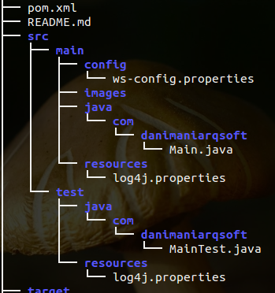

APACHE CXF Client Template
==========================

> ###### Autor: Daniel Cortes Pichardo 
> ###### email: daniel.cortes.pichardo@gmail.com

 

Introduction
-----------------------------

The present project has the goal to help you in the configuration of
java artifacts from WSDL file. Today there are a lot of ways to generate
artifacts needed for connect our application with a web service.
Here I will show you how to configure two of them. The first one consider 
that you know the URI of the **WSDL** and the last one consider that you have got
and stored the **WSDL** in some where of your project; for instance the src/main/config/
location. 

>For futher configuration you can visit the webside of [Apache CXF][apachecxflink]
[apachecxflink]: http://cxf.apache.org/docs/maven-cxf-codegen-plugin-wsdl-to-java.html "Apache CXF"

The project has one configuration file named ws-config.properties and located at src/main/config. All
the  configuration called here are about this file.

 

Configuration 1 - from WSDL URI
-------------------------------

1.- Configuración del plugin:
http://cxf.apache.org/docs/maven-cxf-codegen-plugin-wsdl-to-java.html
o
http://kudalepradeep.blogspot.mx/2013/02/soap-web-services-client-using-apache.html

2.- Debate para elegir la herramienta mas adecuada en la creación de clientes para webservice:
http://stackoverflow.com/questions/3587982/which-is-the-best-mavens-plugin-to-generate-a-web-service-client

&copy; danimaniARQSOFT